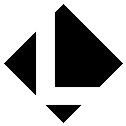

</img>

<h1 align="center">Andrei Zernov</h1>
<h1 align="center">My Professional Portfolio</h1>

---

<h2 align="center">Technologies</h2>

Project is created with:

<ul>
  <li>React: 16.13.0</li>
  <li>typescript: 3.7.5</li>
  <li>mobx-react: 6.2.2</li>
  <li>antd: 4.2.4</li>
  <li>uuid: 8.0.0</li>
</ul>

,

---

<h2 align="center"> Launch and Content</h2>

To launch this project, go to https://andreizernov.netlify.app/

---

<h2> Support</h2>

Reach out to me at one of the following places!

Website at [Andrei Zernov](https://andreizernov.netlify.app/)

Twitter at [AndrewZ](https://twitter.com/AndrewZer)

LinkedIn at [Andrei Zernov](https://www.linkedin.com/in/andrei-zernov/)

---

